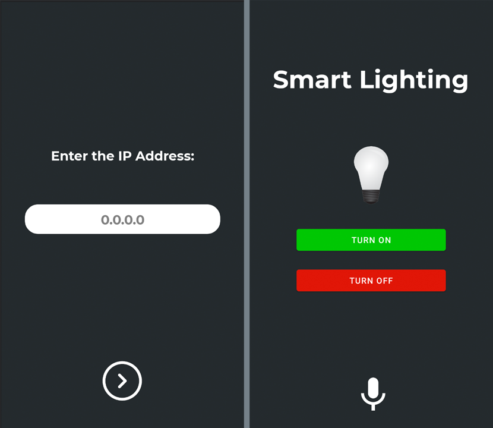

# VoiceControlledSmartLight-Android

IoT Home automation project protoype based on ESP8266 (NodeMCU) using 4-channel relay module. 
Sends commands to ESP8266 Wifi server, uses Google Speech to Text APIs to recognize voice commands.
 
For NodeMCU Setup: https://github.com/devptyagi/VoiceControlledSmartLight-ESP8266     

## Preview:

## GIF:

